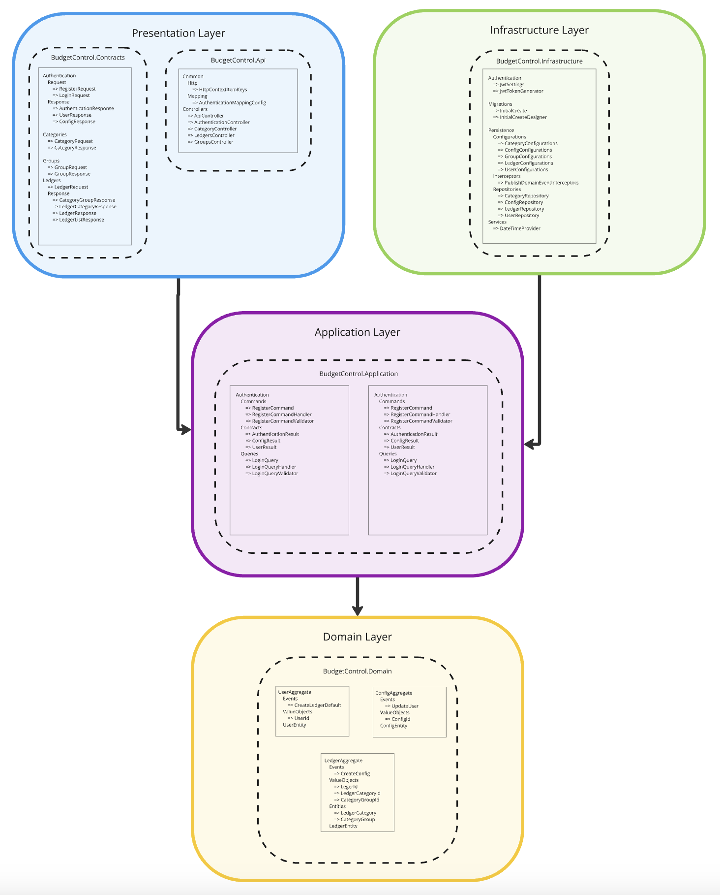
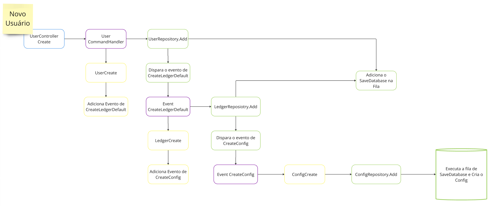

# API Budget Control

Web API para um aplicativo de controlle financeiro.

## Tecnologias

- Mapster
- MediatR
- FluentValidation
- ErrorOr
- DependenceInjection
- EnityFrameworkCore
- TokenJwt

## Estrutura do projeto

- Api
  - Common
    - Http
    - Mapping
  - Controllers
- Application => CQRS
- Contracts
- Domaiin
- Infrastructure
- Interfaces

### Backend Service Archtecture

### DFD New User

# License

This project is licensed under the terms of the [MIT](https://github.com/amantinband/buber-breakfast/blob/main/LICENSE) license.
